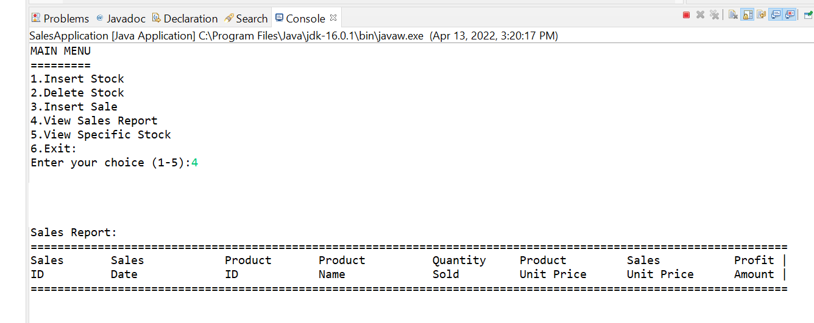

# Inventory-sales 

Java console based application to manage sales and inventory. It manages the details of payment,stock quantity, purchasing, loss/gain per stock, etc.
edditing and updating of records results in proper resource management.

* Frontend - java console.
* Backend - sql oracle o9 database.

  

# Technology Used

* language - Java 
* database - oracle o9
* framework - eclipse

# Note for contributors

* Fork repository and Contribute.
* Extrace zip file or Clone this repository.
* Open this Project in eclipse.
* Open DButil.java file do following changes.
* locate the Database locally by replacing url, user and password 
* open SalesApplication.java and then run it   ..........Ready to go

# Developer
All Suggestions are Accepted and Wellcome. Feel free to report issues and bugs. It will be helpful for further upgradation.
Mohammad Naveed Amir
(naveedamir484@gmail.com)
